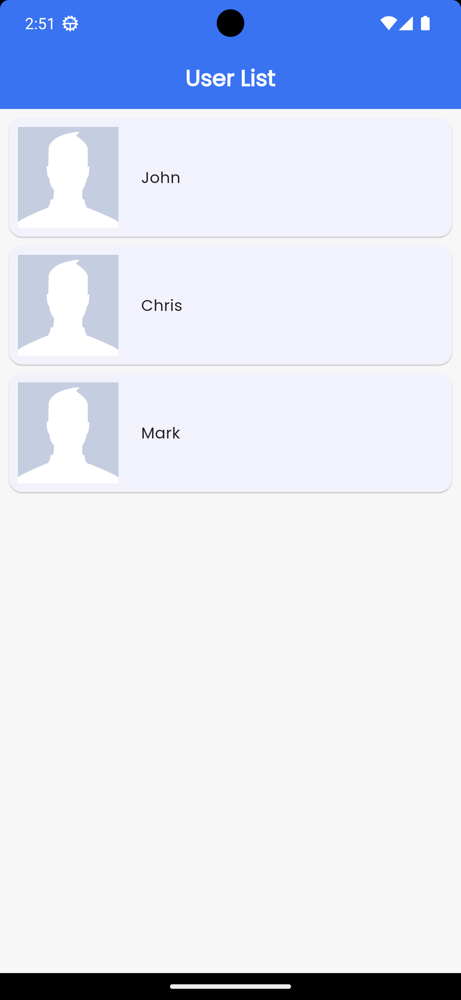
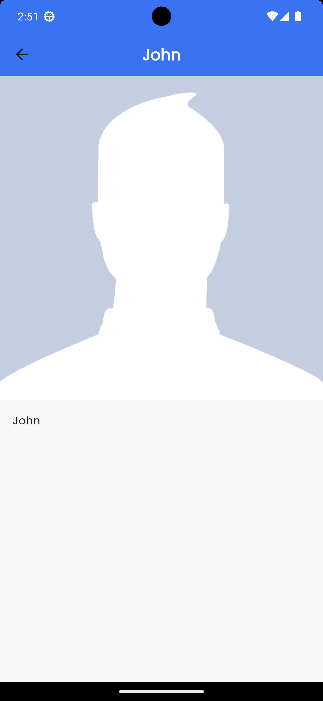

# Introduction

A very simple list-detail project that showcases feature-first MVVM architecture with Riverpod.

# Development

This project is made using Flutter as a test project last November 2023. It showcases the use of feature-first MVVM architecture with Riverpod.

## Packages Used
```
riverpod
equatable
http
intl
logger
google_fonts
flutter_svg
```

This project also uses [FVM - Flutter Version Management](https://fvm.app/) - a simple CLI to manage Flutter SDK versions.

# Screenshots

 
